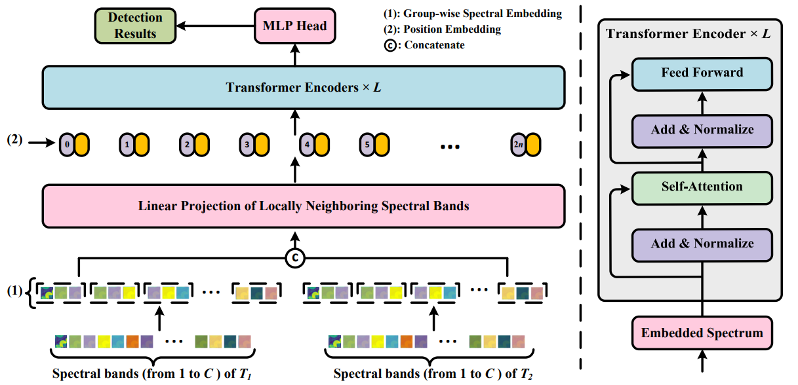

# Spectral–Temporal Transformer for Hyperspectral Image Change Detection--Remote Sensing

Code for the paper "[Spectral–Temporal Transformer for Hyperspectral Image Change Detection](https://www.mdpi.com/2072-4292/15/14/3561)".  More specifically, it is detailed as follow. 




## Data

The datasets can be found in https://rslab.ut.ac.ir/data and https://crabwq.github.io/.

## Citation

Please kindly cite the papers if this code is useful and helpful for your research.

 Li, Xiaorun, and Jigang Ding. 2023. "Spectral–Temporal Transformer for Hyperspectral Image Change Detection" *Remote Sensing* 15, no. 14: 3561. https://doi.org/10.3390/rs15143561.  

```tex
@article{li2023spectral,
  title={Spectral--Temporal Transformer for Hyperspectral Image Change Detection},
  author={Li, Xiaorun and Ding, Jigang},
  journal={Remote Sensing},
  volume={15},
  number={14},
  pages={3561},
  year={2023},
  publisher={MDPI}
}
```

